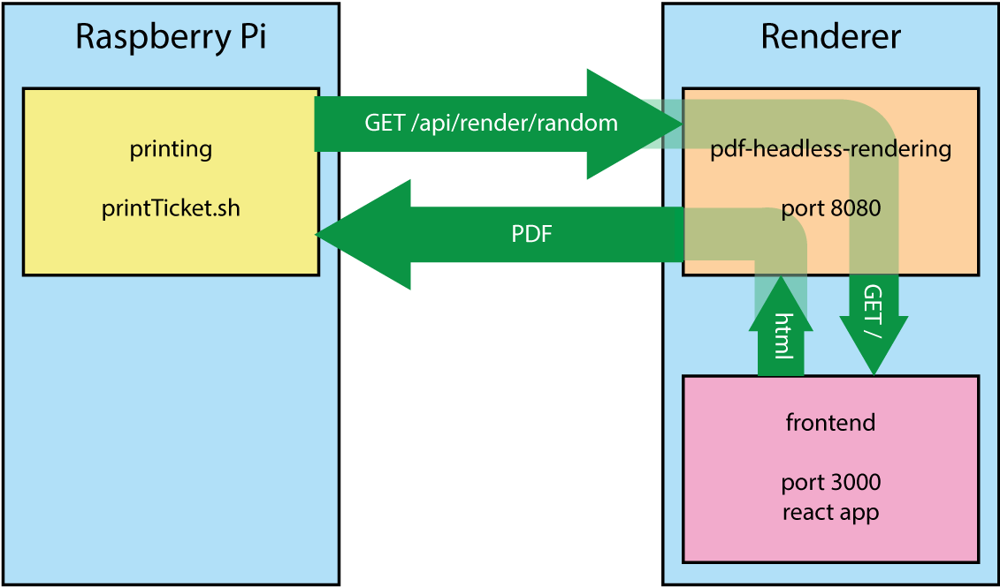

# Ticketing du fun

## Fonctionnement

Le système développé permet d'imprimer un ticket sur l'imprimante à l'appui d'un bouton. Le bouton et l'imprimante sont reliés à un Raspberry Pi.

À l'appui d'un bouton, le Raspberry Pi va demander au Renderer de générer un PDF à imprimer. Le renderer (pdf-headless-rendering) est implémenté en NodeJS et utilise Puppeteer, un module permettant le rendu de page web en mode "headless". Il convertit cette page web en PDF et la renvoie au Raspberry Pi. Ce renderer ne fait que de fetcher une page web générée par React (frontend).



Le Raspberry Pi n'est pas capable de faire tourner Puppeteer. C'est pourquoi le choix a été fait de faire le rendu sur une machine externe. Le pdf-headless-rendering et frontend tournent cependant sur la même machine.

## Installation et configuration

### Raspberry Pi

Le Raspberry Pi est pré-configuré. Cependant, il faut configurer l'URL du Renderer. Ceci est fait dans le fichier `printTicket.sh` situé dans le dossier `/home/pi/qoqa-ticketing-du-fun/printing/`

Pour modifier ce fichier:

1. Connectez un clavier et un écran au Raspberry Pi
2. Redémarrez le Pi en tirant la prise et rebranchant
3. Une fois que le Pi a booté, vous aurez accès à un terminal. Vous pouvez saisir les commandes suivantes

```
cd ~/qoqa-ticketing-du-fun/printing
nano printTicket.sh
```

Pour sauvegarder, faites CTRL+O puis quittez avec CTRL+X

Pour tester une impression, saisissez la commande suivante

```
./printTicket.sh
```

Vous pouvez modifier l'orientation de l'impression en modifiant la commande dans `printTicket.sh`:

***Pour imprimer en petit***
```
lp -d EPSON_TM-T20II -o fit-to-page random
```

***Pour imprimer en grand***
```
lp -d EPSON_TM-T20II random
```

#### Modifier l'adresse IP du Pi
Le Pi doit être dans le même sous-réseau que le serveur de Renderer. Pour changer les paramètres du réseau du Pi:

```
sudo nano /etc/dhcpcd.conf
```

Ensuite, dans les lignes ~40, vous pouvez mettre le Pi en IP fixe:
```
# Example static IP configuration:
interface eth0
static ip_address=192.168.0.10/24
#static ip6_address=fd51:42f8:caae:d92e::ff/64
static routers=192.168.0.1
```
Ou alors le forcer en DHCP en commentant ces lignes:
```
# Example static IP configuration:
#interface eth0
#static ip_address=192.168.0.10/24
#static ip6_address=fd51:42f8:caae:d92e::ff/64
#static routers=192.168.0.1
```
À chaque modification de ce fichier, le plus simple est de reboot le Raspberry Pi:

```
sudo reboot
```

### Renderer

#### PDF Headless Rendering

Rendez-vous dans le dossier `pdf-headless-rendering`

    cd pdf-headless-rendering

Installez les dépendences. ***ATTENTION: Sur Windows, il faut éxecuter cette commande depuis le programme CMD (ligne de commande standard de Windows). Si vous le faites depuis le terminal Linux fourni dans Windows 10, npm installera une version Linux de Chromium, qui ne fonctionnera pas.***

    npm install

Ceci installera Puppeteer et la version de chromium nécessaire à son fonctionnement.

Ensuite, il suffit de créer un fichier de configuration. Vous pouvez utiliser le fichier par défaut.

    cp src/Config.default src/Config.mjs

Puis, pour lancer le serveur, faites simplement

    npm start

Le serveur est maintenant prêt à transformer les pages web en PDF!

#### Frontend (application React)

Rendez-vous dans le dossier `frontend`

    cd frontend

Installez les dépendences

    npm install

Ceci installera la toolchain React et tous les modules nécessaires.

Vous pouvez ensuite lancer l'application React

    npm start

Qui se lancera sur le port 3000.

### Tester

Pour tester que le rendu PDF fonctionne, rendez-vous simplement avec votre navigateur sur

    http://localhost:8080/api/render/random

Vous devriez voir un PDF s'afficher!

## Créez votre propre ticket

Créer un ticket est très simple! Tous les tickets sont des composants React. 

Nous allons partir sur un exemple "Hello World". 

### Etape 1: Créer le dossier

Créez un dossier `HelloWorldTicket` dans `frontend/src/Components/Tickets/`

Créez un fichier `HelloWorldTicket.js` et sa stylesheet associée `HelloWorldTicket.scss`

### Etape 2: Include le fichier

Dans le fichier `frontend/src/Containers/TicketContainer/TicketContainer.js`, ajouter le code suivant en en-tête du fichier

    import HelloWorldTicket from 'Components/Tickets/HelloWorld/HelloWorldTicket';

À la ligne 16 environ, ajouter votre nouveau ticket à la liste des tickets possibles:

```
  {
    content: (onError, onLoaded) => <HelloWorldTicket onError={onError} onLoaded={onLoaded}/>
  }  
```

### Etape 3: Ecrire le code de votre ticket

Nous n'allons pas rentrer dans les détails d'un composant React ici, mais vous pouvez déjà copier-coller ce code dans votre fichier `HelloWorldTicket.js`

```
import React, { Component } from 'react';

import Tool from 'Classes/Tool';

import Data from 'Data/data.json';

import './HelloWorldTicket.scss';
import 'Components/Tickets/HelloWorldTicket.scss';

class HelloWorldTicket extends Component {

  constructor(){

    super();

  }

  componentDidMount(){

    this.props.onLoaded();

  }

  render(){

    return(

      <div className="ticket hello-world-ticket">

        <h1 className="hello">Hello World</h1>

      </div>

    );

  }  

}

export default HelloWorldTicket;

```

Puis dans votre fichier `HelloWorldTicket.scss`, coller ce code

```
.hello-world-ticket{

  width: 8cm;
  height: 8cm;
  text-align: center;

  display: flex;
  justify-content: center;
  flex-direction: column;
  text-align: center;

  .hello{

    font-size: 20pt;

  }

}
```

Le système a été prévu pour que des tickets puissent charger des données de manière asynchrone. Par exemple si vous voulez vous connecter à une API pour récuperer des données.

Ainsi, ce qui est important de faire, c'est d'appeler la fonction `onLoaded` passée comme property de ce composant par le TicketContainer:

    this.props.onLoaded();

Ceci indique au Container que ce Composant est prêt à être imprimé. Au-delà de la chaine, l'application `pdf-headless-rendering` attend que cette fonction soit appelée avant de faire le rendu PDF.

Voilà, vous pouvez tester votre nouveau composant Hello World en vous rendant sur `http://localhost:8080/api/render/random`!

## Quelques considérations

Imprimer sur une imprimante à tickets impliques quelques limitations techniques...

Premièrement, l'imprimante est noir/blanc et réalise les niveaux de gris par "dithering". Les images ne rendent pas très bien.

Le papier fait 8cm de large et la hauteur n'est pas limitée. Cependant, on conseille de faire un format carré de 8cm x 8cm.

Il est donc important que vos styles contiennent le déclarations CSS suivantes:

```
  width: 8cm;
  height: 8cm;
```

Et pour le conteneur:

```
@media print 
{
   @page
   {
    size: 8cm;
    margin: 1cm;
  }

}

.ticket{

  white-space: pre-wrap;

}
```

Happy coding!
